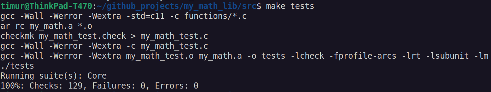
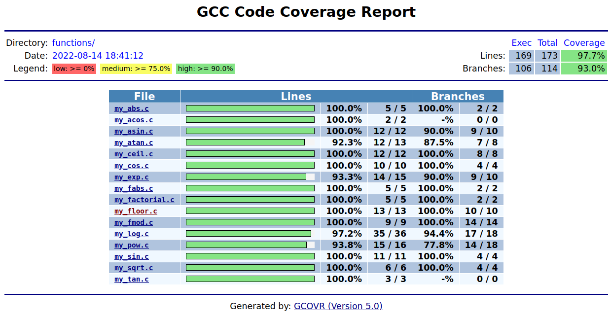
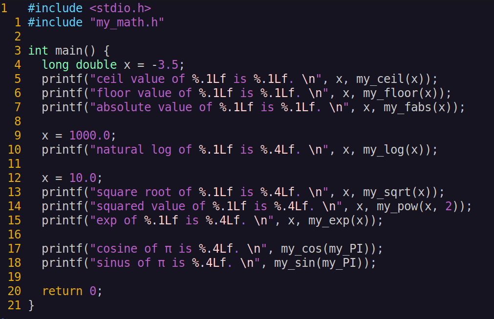
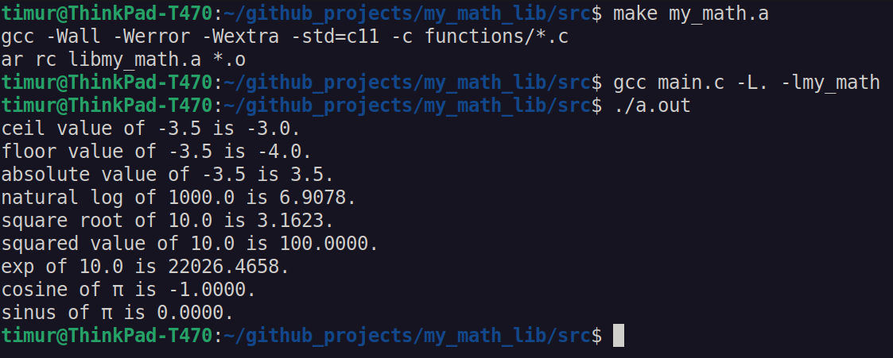

# __My implementation of math library__

## __Description of project:__

__In this project I developed my own version of the standard math.h library in the C programming language. This library implements basic mathematical operations, which are then used in various algorithms.__

C mathematical operations are a group of functions in the standard library of the C programming language implementing basic mathematical functions. All functions use floating-point numbers in one manner or another. Different C standards provide different, albeit backwards-compatible, sets of functions. Any functions that operate on angles use radians as the unit of angle.

The library developed in accordance with the principles of structured programming as a static library (with the header file my_math.h) in C programming language of C11 standart.

I followed the logic of the standard math.h library (in terms of checks, working with memory and behavior in emergency situations).

Unit-tests check the results of my implementation by comparing them with the implementation of the standard math.h library

## __Description of functions from my_math.h:__

| No. | Function | Description |
| --- | -------- | ----------- |
| 1 | `int abs(int x)` | computes absolute value of an integer value |
| 2 | `long double acos(double x)` | computes arc cosine |
| 3 | `long double asin(double x)` | computes arc sine |
| 4 | `long double atan(double x)` | computes arc tangent |
| 5 | `long double ceil(double x)` | returns the nearest integer not less than the given value |
| 6 | `long double cos(double x)` | computes cosine |
| 7 | `long double exp(double x)` | returns e raised to the given power |
| 8 | `long double fabs(double x)` | computes absolute value of a floating-point value |
| 9 | `long double floor(double x)` | returns the nearest integer not greater than the given value |
| 10 | `long double fmod(double x, double y)` | remainder of the floating-point division operation |
| 11 | `long double log(double x)` | computes natural logarithm |
| 12 | `long double pow(double base, double exp)` | raises a number to the given power |
| 13 | `long double sin(double x)` | computes sine |
| 14 | `long double sqrt(double x)` | computes square root |
| 15 | `long double tan(double x)` | computes tangent |

## __Compilation:__
Use make utility for building the library and tests.

Make targets:
 - my_math.a (get a static library)
 - tests (run unit-tests)
 - gcov_report (generate a gcov report in the form of an html page)

## __Unit-tests and reports:__

## __Usage:__
Write some example code:

Compile code with library using gcc
